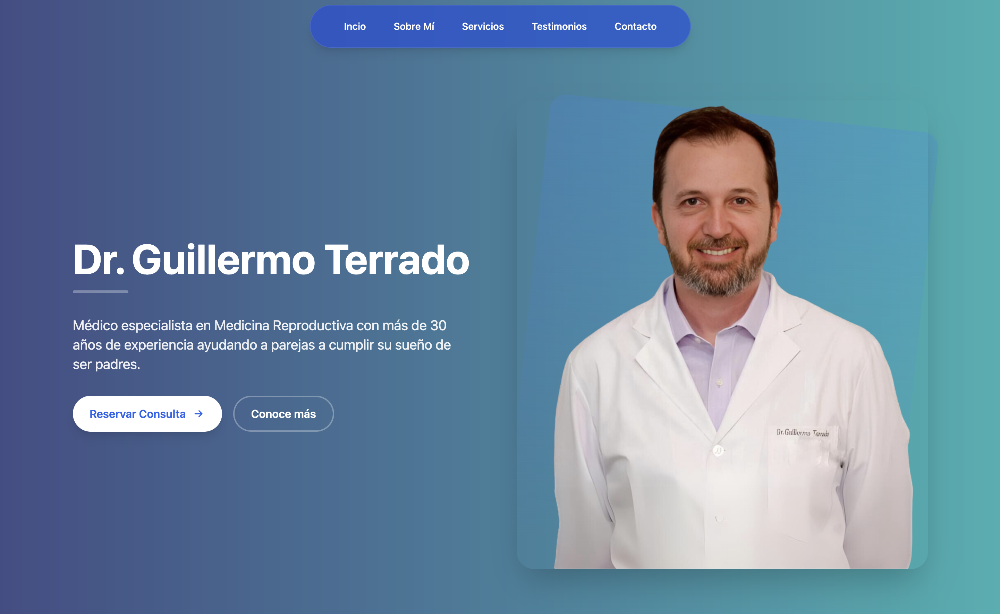

# Landing Page: Dr. Guillermo Terrado

Esta es la landing page oficial del Dr. Guillermo Terrado, un médico especialista en Medicina Reproductiva con más de 30 años de experiencia ayudando a parejas a cumplir su sueño de ser padres.

## 🌐 URL del Proyecto

[https://drguillermoterrado.com](https://drguillermoterrado.com)

## 🖼️ Vista Previa



## 🚀 Estructura del Proyecto

La estructura principal del proyecto es la siguiente:

```text
/
├── public/
│   └── favicon.svg
├── src/
│   ├── components/
│   │   ├── Header.astro        # Barra de navegación
│   │   ├── Hero.astro          # Sección principal
│   │   ├── SobreMi.astro       # Información profesional
│   │   ├── Services.astro      # Servicios ofrecidos
│   │   ├── Testimonials.astro  # Testimonios de pacientes
│   │   ├── Centros.astro       # Centros medicos
│   │   └── Contact.astro       # Formulario de contacto
│   ├── layouts/
│   │   └── Layout.astro        # Layout base del proyecto
│   └── pages/
│       └── index.astro         # Página principal
└── package.json
```

## ✨ Características de la Landing Page

    •	Barra de Navegación: Incluye enlaces a las secciones
    •	Sección Hero: Presenta al Dr. Guillermo Terrado
    •   Sobre mi: Detalla el registro del doctor.
    •	Servicios: Lista los servicios de medicina reproductiva.
    •	Testimonios: Comentarios reales de pacientes que han sido atendidos por el doctor.
    •   Centros: Expone los centros de fertilidad en donde trabaja.
    •	Formulario de Contacto: Facilita la reserva de consultas.

## 🌟 Tecnologías Utilizadas

    •	Astro: Framework principal para construir el sitio.
    •	HTML5: Estructura del proyecto.
    •	CSS3: Diseño y animaciones.
    •	TailwindCSS: Para estilos modernos y responsivos.
    •	JavaScript: Para funcionalidades interactivas.

## 👀 Más Información

Para más detalles sobre el Dr. Guillermo Terrado y sus servicios, visita la página oficial: drguillermoterrado.com.
